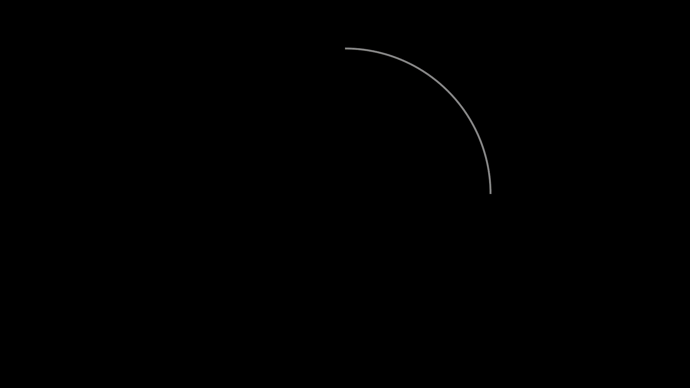
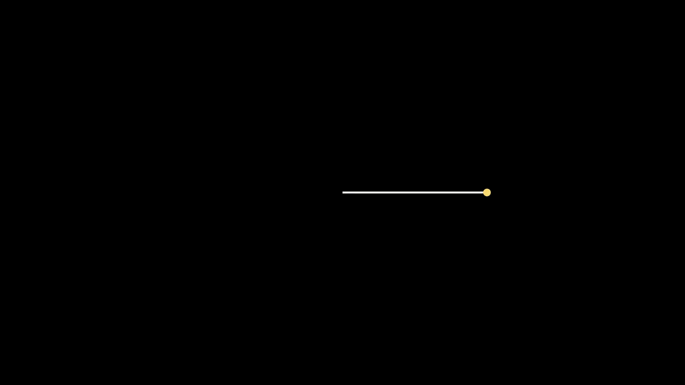

# ΚΕΦΑΛΑΙΟ 1: Εισαγωγή στη Manim, Σκηνές, Γεωμετρικά Αντικείμενα και Βασικές Κινήσεις

## 1. Συνοπτική Θεωρία (Brief Theory)

Η βιβλιοθήκη **Manim** (Mathematical Animation Engine) είναι ένα εργαλείο της Python που χρησιμοποιείται για τη δημιουργία μαθηματικών γραφικών και κινουμένων σχεδίων.

### 1.1 Το Σύστημα Συντεταγμένων (Coordinate System)
Η Manim χρησιμοποιεί ένα τρισδιάστατο καρτεσιανό σύστημα συντεταγμένων με κέντρο την αρχή των αξόνων $O(0,0,0)$. 
*   **Διαστάσεις Σκηνής (Default 16:9):** Το πλάτος της οθόνης εκτείνεται από $x = -7.11$ έως $x = 7.11$ (συνολικά $14.22$ μονάδες), και το ύψος από $y = -4.0$ έως $y = 4.0$ (συνολικά $8.0$ μονάδες).
*   **Κατευθυντήρια Διανύσματα (Direction vectors):**
    *   $\text{UP} = [0, 1, 0]^T$
    *   $\text{DOWN} = [0, -1, 0]^T$
    *   $\text{LEFT} = [-1, 0, 0]^T$
    *   $\text{RIGHT} = [1, 0, 0]^T$
    *   $\text{ORIGIN} = [0, 0, 0]^T$

```text
                  +Y (UP = [0, 1, 0])
                           ^
                           | (0, 4, 0)
                           |
  (-7.11, 0, 0)            |            (7.11, 0, 0)
  <---------------------+---------------------> +X (RIGHT = [1, 0, 0])
  LEFT                     | ORIGIN             RIGHT
                           | (0, 0, 0)
                           |
                           v (0, -4, 0)
                  -Y (DOWN = [0, -1, 0])
```

### 1.2 Μαθηματικά Αντικείμενα (Mobjects)
Κάθε οπτικό στοιχείο στη Manim κληρονομεί από την κλάση `Mobject`. Τα διανυσματικά αντικείμενα κληρονομούν από την `VMobject` (Vector Mobject).

| Κλάση Mobject | Περιγραφή | Βασικές Παράμετροι |
| :--- | :--- | :--- |
| `Circle` | Κύκλος | `radius`, `color`, `fill_opacity` |
| `Square` | Τετράγωνο | `side_length`, `color` |
| `Rectangle` | Ορθογώνιο | `width`, `height`, `color` |
| `Line` | Ευθύγραμμο Τμήμα | `start`, `end`, `stroke_width` |
| `Triangle` | Ισόπλευρο Τρίγωνο | Αυτόματος υπολογισμός κορυφών |

### 1.3 Βασικές Μέθοδοι Μετασχηματισμού & Κίνησης
*   `shift(\vec{v})`: Μετατόπιση κατά διάνυσμα $\vec{v} = [x, y, z]^T$.
*   `scale(s)`: Κλιμάκωση (μεγέθυνση/σμίκρυνση) κατά παράγοντα $s \in \mathbb{R}^+$.
*   `rotate(\theta)`: Στροφή κατά γωνία $\theta$ (σε ακτίνια/radians) με φορά αντίθετη των δεικτών του ρολογιού.
*   `next_to(mobject, direction)`: Τοποθέτηση ενός αντικειμένου δίπλα σε ένα άλλο κατά τη διεύθυνση `direction`.

---

## 2. Λυμένα Προβλήματα (Solved Problems)

### Πρόβλημα 1.1
**Εκφώνηση:** Να γραφεί κώδικας Manim που να δημιουργεί έναν κόκκινο κύκλο με ακτίνα $R = 1.5$ στην αρχή των αξόνων και να τον εμφανίζει ομαλά στην οθόνη.

**Λύση:**
Χρησιμοποιούμε την κλάση `Circle` ορίζοντας την παράμετρο `radius=1.5` και `color=RED`. Για την ομαλή εμφάνιση χρησιμοποιούμε την κίνηση `Create`.

```python
from manim import *

class SimpleCircle(Scene):
    def construct(self):
        # Δημιουργία κύκλου με ακτίνα 1.5
        circle = Circle(radius=1.5, color=RED)
        
        # Εμφάνιση του κύκλου στην οθόνη
        self.play(Create(circle))
        self.wait(1)
```

#### 🤔 Γιατί class και def? τι είναι το self?
[Class](https://github.com/OdyGaz/python-fundamentals/blob/main/satellite%20notes/Assets/22060602_%CE%95%CE%B9%CF%83%CE%B1%CE%B3%CF%89%CE%B3%CE%AE_%CF%83%CF%84%CE%B7_Manim_class.md)

#### 🤔 Γιατί δεν εμφανίζεται το video?
[22060601_Εισαγωγή_στη_Manim_video_player](https://github.com/OdyGaz/python-fundamentals/blob/main/satellite%20notes/Assets/22060601_%CE%95%CE%B9%CF%83%CE%B1%CE%B3%CF%89%CE%B3%CE%AE_%CF%83%CF%84%CE%B7_Manim_video_player.md)

#### 🤔 Install Manim and dependencies ?
[22060601_Εισαγωγή_στη_Manim_install](https://github.com/OdyGaz/python-fundamentals/blob/main/satellite%20notes/Assets/22060601_%CE%95%CE%B9%CF%83%CE%B1%CE%B3%CF%89%CE%B3%CE%AE_%CF%83%CF%84%CE%B7_Manim_install.md)

#### 🤔 Κατανόηση του κώδικα?
[22060601_Εισαγωγή_στη_Manim_ανάλυση_snippet](https://github.com/OdyGaz/python-fundamentals/blob/main/satellite%20notes/Assets/22060601_%CE%95%CE%B9%CF%83%CE%B1%CE%B3%CF%89%CE%B3%CE%AE_%CF%83%CF%84%CE%B7_Manim_%CE%B1%CE%BD%CE%AC%CE%BB%CF%85%CF%83%CE%B7_snippet.md)


### Πρόβλημα 1.2
**Εκφώνηση:** Να δημιουργηθεί ένα μπλε τετράγωνο πλευράς $a = 2.0$. Το τετράγωνο πρέπει να τοποθετηθεί στο σημείο $P(3, 2, 0)$ χρησιμοποιώντας κατάλληλη μέθοδο μετατόπισης.

**Λύση:**
Χρησιμοποιούμε την κλάση `Square` με `side_length=2.0`. Για τη μετατόπιση εφαρμόζουμε τη μέθοδο `shift()` με όρισμα το διάνυσμα $3\cdot\text{RIGHT} + 2\cdot\text{UP}$.

```python
from manim import *

class PositionedSquare(Scene):
    def construct(self):
        # Δημιουργία τετραγώνου
        square = Square(side_length=2.0, color=BLUE)
        
        # Μετατόπιση στο σημείο (3, 2, 0)
        square.shift(3 * RIGHT + 2 * UP)
        
        # Εμφάνιση της σκηνής
        self.play(FadeIn(square))
        self.wait(1)
```

#### 🤔 πώς κάνω GIF με την manim?
[22060601_Εισαγωγή_στη_Manim_GIF](https://github.com/OdyGaz/python-fundamentals/blob/main/satellite%20notes/Assets/22060601_%CE%95%CE%B9%CF%83%CE%B1%CE%B3%CF%89%CE%B3%CE%AE_%CF%83%CF%84%CE%B7_Manim_GIF.md)

---


---

### Πρόβλημα 1.3
**Εκφώνηση:** Να σχεδιαστεί ένα ευθύγραμμο τμήμα από το σημείο $A(-3, -1, 0)$ έως το σημείο $B(2, 3, 0)$ με πάχος γραμμής $8$ και πράσινο χρώμα.

**Λύση:**
Χρησιμοποιούμε την κλάση `Line` ορίζοντας τα διανύσματα θέσης για την αρχή (`start`) και το τέλος (`end`). Η παράμετρος `stroke_width` ορίζει το πάχος.

```python
from manim import *

class DrawLine(Scene):
    def construct(self):
        # Ορισμός σημείων A και B
        point_a = np.array([-3, -1, 0])
        point_b = np.array([2, 3, 0])
        
        # Δημιουργία της γραμμής
        line = Line(start=point_a, end=point_b, stroke_width=8, color=GREEN)
        
        # Κίνηση δημιουργίας της γραμμής από το Α στο Β
        self.play(Create(line))
        self.wait(1)
```


### Πρόβλημα 1.4
**Εκφώνηση:** Να πραγματοποιηθεί η γεωμετρική μεταμόρφωση (morphing) ενός κίτρινου τετραγώνου πλευράς $2$ σε έναν κίτρινο κύκλο ίδιας επιφάνειας, με τη χρήση της κλάσης `Transform`.

**Λύση:**
Η επιφάνεια του τετραγώνου είναι $E_{\tau\epsilon\tau} = a^2 = 2^2 = 4$. Για να είναι η επιφάνεια του κύκλου ίση, πρέπει $\pi R^2 = 4 \Rightarrow R = \sqrt{4/\pi} \approx 1.13$. 
Ορίζουμε τα δύο αντικείμενα και εκτελούμε τη μετάβαση με την `Transform`.

```python
from manim import *
import math

class SquareToCircleTransform(Scene):
    def construct(self):
        # Υπολογισμός ακτίνας για ισοδύναμο εμβαδόν
        r = math.sqrt(4.0 / math.pi)
        
        # Δημιουργία αρχικού και τελικού σχήματος
        square = Square(side_length=2.0, color=YELLOW)
        circle = Circle(radius=r, color=YELLOW)
        
        # Εμφάνιση αρχικού τετραγώνου
        self.play(Create(square))
        self.wait(0.5)
        
        # Μετασχηματισμός του τετραγώνου σε κύκλο
        self.play(Transform(square, circle))
        self.wait(1)
```

#### 🤔 πώς κάνω GIF με την manim?


### Πρόβλημα 1.5
**Εκφώνηση:** Να δημιουργηθεί ένα ορθογώνιο παραλληλόγραμμο με πλάτος $3$ και ύψος $1.5$. Στη συνέχεια, να περιστραφεί κατά γωνία $\theta = \frac{\pi}{3}$ ως προς το κέντρο του και να μεγεθυνθεί κατά παράγοντα $s = 1.5$.

**Λύση:**
Χρησιμοποιούμε τις μεθόδους `rotate()` και `scale()`. Για να δειχθεί η κίνηση περιστροφής και μεγέθυνσης στην οθόνη, εφαρμόζουμε τις μεθόδους αυτές μέσα στην `self.play()` χρησιμοποιώντας τη σύνταξη `.animate`.

```python
from manim import *
import math

class TransformRectangle(Scene):
    def construct(self):
        # Δημιουργία ορθογωνίου
        rect = Rectangle(width=3.0, height=1.5, color=PURPLE)
        self.play(Create(rect))
        self.wait(0.5)
        
        # Ταυτόχρονη περιστροφή κατά π/3 και κλιμάκωση κατά 1.5
        self.play(
            rect.animate.rotate(math.pi / 3).scale(1.5)
        )
        self.wait(1)
```
#### 🤔 πώς κάνω GIF με την manim?


### Πρόβλημα 1.6
**Εκφώνηση:** Να σχεδιαστούν τρεις ομόκεντροι κύκλοι με ακτίνες $R_1 = 0.5$, $R_2 = 1.0$ και $R_3 = 1.5$. Οι κύκλοι πρέπει να εμφανιστούν ταυτόχρονα με εφέ `FadeIn` αλλά με διαφορετικούς χρόνους καθυστέρησης (run time).

**Λύση:**
Δημιουργούμε μια λίστα από αντικείμενα `Circle` και εκτελούμε την `self.play()` περνώντας πολλαπλές κινήσεις `FadeIn`, ορίζοντας την παράμετρο `run_time` για καθεμία.

```python
from manim import *

class ConcentricCircles(Scene):
    def construct(self):
        # Δημιουργία των 3 ομόκεντρων κύκλων
        c1 = Circle(radius=0.5, color=RED)
        c2 = Circle(radius=1.0, color=GREEN)
        c3 = Circle(radius=1.5, color=BLUE)
        
        # Ταυτόχρονη εμφάνιση με διαφορετική διάρκεια (run_time)
        self.play(
            FadeIn(c1, run_time=1.0),
            FadeIn(c2, run_time=2.0),
            FadeIn(c3, run_time=3.0)
        )
        self.wait(1)
```


#### 🤔 πώς κάνω GIF με την manim?


### Πρόβλημα 1.7
**Εκφώνηση:** Να δημιουργηθεί μια ομάδα αντικειμένων (`VGroup`) αποτελούμενη από ένα τετράγωνο και έναν κύκλο που εφάπτεται εξωτερικά στη δεξιά πλευρά του. Στη συνέχεια, να μετατοπιστεί ολόκληρη η ομάδα κατά $3$ μονάδες αριστερά.

**Λύση:**
Η κλάση `VGroup` επιτρέπει την ομαδοποίηση διανυσματικών αντικειμένων ώστε να υφίστανται μετασχηματισμούς ως ενιαία οντότητα. Χρησιμοποιούμε τη μέθοδο `next_to(target, direction, buff=0)` για την ακριβή τοποθέτηση χωρίς κενό (`buff=0`).

```python
from manim import *

class VGroupExample(Scene):
    def construct(self):
        # Δημιουργία σχημάτων
        square = Square(side_length=2.0, color=ORANGE)
        circle = Circle(radius=1.0, color=PINK)
        
        # Τοποθέτηση του κύκλου ακριβώς δεξιά από το τετράγωνο (εφαπτόμενα)
        circle.next_to(square, RIGHT, buff=0)
        
        # Ομαδοποίηση
        group = VGroup(square, circle)
        
        # Εμφάνιση της αρχικής ομάδας στο κέντρο
        self.play(Create(group))
        self.wait(0.5)
        
        # Μετατόπιση ολόκληρης της ομάδας αριστερά κατά 3 μονάδες
        self.play(group.animate.shift(3 * LEFT))
        self.wait(1)
```

#### 🤔 πώς κάνω GIF με την manim?


### Πρόβλημα 1.8
**Εκφώνηση:** Ένα υλικό σημείο (μικρός κύκλος ακτίνας $r=0.1$) κινείται κατά μήκος ενός τεταρτοκυκλίου ακτίνας $R=3$ στο πρώτο τεταρτημόριο. Να γραφεί ο κώδικας προσομοίωσης αυτής της κίνησης.

**Λύση:**
Σχεδιάζουμε ένα τόξο `Arc` με ακτίνα $R=3$, γωνία εκκίνησης $0$ και γωνία κάλυψης $\pi/2$. Χρησιμοποιούμε την κίνηση `MoveAlongPath` για να αναγκάσουμε το σημείο (Dot) να ακολουθήσει την τροχιά του τόξου.

```python
from manim import *
import math

class PathMovement(Scene):
    def construct(self):
        # Δημιουργία της τροχιάς (τεταρτοκύκλιο)
        arc_path = Arc(radius=3.0, start_angle=0, angle=math.pi / 2, color=GRAY)
        
        # Δημιουργία του κινητού σημείου
        moving_dot = Dot(color=RED).scale(1.5)
        
        # Τοποθέτηση του σημείου στην αρχή της τροχιάς
        moving_dot.move_to(arc_path.get_start())
        
        # Εμφάνιση τροχιάς και σημείου
        self.add(arc_path)
        self.play(FadeIn(moving_dot))
        
        # Κίνηση κατά μήκος της τροχιάς
        self.play(MoveAlongPath(moving_dot, arc_path), run_time=3, rate_func=linear)
        self.wait(1)
```

#### 🤔 πώς κάνω GIF με την manim?


### Πρόβλημα 1.9
**Εκφώνηση:** Να δημιουργηθεί μια δυναμική σκηνή όπου μια ευθεία συνδέει την αρχή των αξόνων $O(0,0,0)$ με ένα σημείο $P$. Το σημείο $P$ κινείται κυκλικά με σταθερή γωνιακή ταχύτητα. Η ευθεία πρέπει να ενημερώνει αυτόματα τη θέση της ώστε να ακολουθεί το σημείο $P$.

**Λύση:**
Χρησιμοποιούμε τις συναρτήσεις ενημέρωσης (`updaters`). Η μέθοδος `add_updater()` επιτρέπει σε ένα αντικείμενο να τροποποιεί τις ιδιότητές του σε κάθε frame της κίνησης.

```python
from manim import *
import math

class DynamicLinePointer(Scene):
    def construct(self):
        # Ορισμός της αρχής των αξόνων
        origin = ORIGIN
        
        # Δημιουργία σημείου P
        dot_p = Dot(point=3 * RIGHT, color=YELLOW)
        
        # Δημιουργία της γραμμής που συνδέει το O με το P
        # Χρησιμοποιούμε decimal/always_redraw ή updaters
        line = Line(start=origin, end=dot_p.get_center(), color=WHITE)
        
        # Ορισμός updater για τη γραμμή
        def update_line(obj):
            obj.put_start_and_end_on(origin, dot_p.get_center())
            
        line.add_updater(update_line)
        
        # Προσθήκη αντικειμένων στη σκηνή
        self.add(line, dot_p)
        
        # Περιστροφή του σημείου P γύρω από το κέντρο κατά 2π (πλήρης κύκλος)
        self.play(
            Rotate(dot_p, angle=2 * math.pi, about_point=origin, run_time=4),
            rate_func=linear
        )
        
        # Αφαίρεση του updater στο τέλος
        line.remove_updater(update_line)
        self.wait(1)
```

#### 🤔 πώς κάνω GIF με την manim?


### Πρόβλημα 1.10
**Εκφώνηση (Επίπεδο Εξετάσεων):** Να κατασκευαστεί μια σύνθετη γεωμετρική απόδειξη για την ταυτότητα $(a+b)^2 = a^2 + 2ab + b^2$ με $a=2$ και $b=1$. Η σκηνή πρέπει να εμφανίζει:
1. Ένα μεγάλο τετράγωνο πλευράς $a+b = 3$.
2. Τη διαμέριση αυτού του τετραγώνου σε $4$ επιμέρους σχήματα: ένα τετράγωνο $a \times a$ (κόκκινο), ένα τετράγωνο $b \times b$ (μπλε) και δύο ορθογώνια $a \times b$ και $b \times a$ (πράσινα).
Τα σχήματα πρέπει να εμφανίζονται διαδοχικά και να τοποθετούνται στις σωστές θέσεις.

**Λύση:**
Υπολογίζουμε τις σχετικές θέσεις των επιμέρους σχημάτων με βάση την αρχή των αξόνων.
Έστω ότι το κάτω αριστερό σημείο του μεγάλου τετραγώνου τοποθετείται στο $[-1.5, -1.5, 0]$.
*   Κόκκινο τετράγωνο ($2 \times 2$): Τοποθετείται κάτω αριστερά. Κέντρο στο $[-0.5, -0.5, 0]$.
*   Μπλε τετράγωνο ($1 \times 1$): Τοποθετείται πάνω δεξιά. Κέντρο στο $[1.0, 1.0, 0]$.
*   Πράσινο ορθογώνιο 1 ($2 \times 1$): Τοποθετείται πάνω αριστερά. Κέντρο στο $[-0.5, 1.0, 0]$.
*   Πράσινο ορθογώνιο 2 ($1 \times 2$): Τοποθετείται κάτω δεξιά. Κέντρο στο $[1.0, -0.5, 0]$.

```python
from manim import *

class GeometricIdentity(Scene):
    def construct(self):
        # Ορισμός διαστάσεων
        a = 2.0
        b = 1.0
        
        # 1. Δημιουργία των επιμέρους σχημάτων
        # Κόκκινο τετράγωνο a^2
        sq_a = Square(side_length=a, color=RED, fill_opacity=0.6)
        sq_a.move_to(np.array([-0.5, -0.5, 0]))
        
        # Μπλε τετράγωνο b^2
        sq_b = Square(side_length=b, color=BLUE, fill_opacity=0.6)
        sq_b.move_to(np.array([1.0, 1.0, 0]))
        
        # Πράσινο ορθογώνιο ab (πάνω αριστερά)
        rect_ab1 = Rectangle(width=a, height=b, color=GREEN, fill_opacity=0.6)
        rect_ab1.move_to(np.array([-0.5, 1.0, 0]))
        
        # Πράσινο ορθογώνιο ba (κάτω δεξιά)
        rect_ab2 = Rectangle(width=b, height=a, color=GREEN, fill_opacity=0.6)
        rect_ab2.move_to(np.array([1.0, -0.5, 0]))
        
        # 2. Ομαδική δημιουργία
        self.play(FadeIn(sq_a))
        self.wait(0.3)
        self.play(FadeIn(sq_b))
        self.wait(0.3)
        self.play(FadeIn(rect_ab1), FadeIn(rect_ab2))
        self.wait(0.5)
        
        # 3. Δημιουργία εξωτερικού περιγράμματος (Μεγάλο τετράγωνο a+b)
        large_square = Square(side_length=a+b, color=WHITE, stroke_width=4)
        large_square.move_to(np.array([0.25, 0.25, 0])) # Κέντρο του συνολικού σχήματος
        
        self.play(Create(large_square), run_time=2)
        self.wait(1.5)
```

#### 🤔 πώς κάνω GIF με την manim?

---

## 3. Συμπληρωματικά / Άλυτα Προβλήματα (Supplementary Problems)

### Πρόβλημα 1.11
Δημιουργήστε ένα ισόπλευρο τρίγωνο (`Triangle`) με μήκος πλευράς $s = 3.0$ και κίτρινο χρώμα. Τοποθετήστε το στην οθόνη και εκτελέστε μια πλήρη περιστροφή $\theta = 2\pi$ γύρω από την κορυφή του που δείχνει προς τα πάνω (όχι γύρω από το κέντρο βάρους του).
*(Απάντηση / Υπόδειξη: Χρησιμοποιήστε τη μέθοδο `Rotate(triangle, angle=2*PI, about_point=triangle.get_vertices()[0])`)*

```python
from manim import *

class RotateTriangle(Scene):
    def construct(self):
        # 1. Δημιουργία κίτρινου ισόπλευρου τριγώνου με μήκος πλευράς s = 3.0
        triangle = Triangle(color=YELLOW)
        triangle.set_width(3.0)

        # 2. Τοποθέτηση και εμφάνιση του τριγώνου στην οθόνη
        self.add(triangle)
        self.wait(1)

        # 3. Εύρεση της πάνω κορυφής
        top_vertex = triangle.get_vertices()[0]

        # 4. Εκτέλεση της πλήρους περιστροφής 2π γύρω από την πάνω κορυφή
        self.play(
            Rotate(
                triangle, 
                angle=2 * PI, 
                about_point=top_vertex,
                run_time=3  # διάρκεια της κίνησης σε δευτερόλεπτα
            )
        )
        self.wait(1)
```


### Πρόβλημα 1.12
Κατασκευάστε ένα ορθογώνιο πλάτους $w=4.0$ και ύψους $h=2.0$ με λευκό περίγραμμα. Στη συνέχεια, χωρίστε το οριζόντια στη μέση με μια κόκκινη διακεκομμένη γραμμή και εμφανίστε τα δύο σχήματα ταυτόχρονα στην οθόνη.
*(Απάντηση / Υπόδειξη: Χρησιμοποιήστε `Rectangle` και `DashedLine` από το σημείο $[-2, 0, 0]$ έως το $[2, 0, 0]$)*

```python
from manim import *

class SplitRectangle(Scene):
    def construct(self):
        # 1. Κατασκευή του ορθογωνίου με λευκό περίγραμμα
        rect = Rectangle(
            color=WHITE, 
            width=4.0, 
            height=2.0
        )
        
        # 2. Κατασκευή της κόκκινης διακεκομμένης γραμμής
        # Η γραμμή ξεκινά από το αριστερό άκρο [-2, 0, 0] έως το δεξί [2, 0, 0]
        dashed_line = DashedLine(
            start=[-2, 0, 0], 
            end=[2, 0, 0], 
            color=RED
        )
        
        # 3. Ταυτόχρονη εμφάνιση των δύο σχημάτων στην οθόνη
        self.play(
            Create(rect),
            Create(dashed_line),
            run_time=2  # Διάρκεια της κίνησης σε δευτερόλεπτα
        )
        
        # Αναμονή στο τέλος της σκηνής
        self.wait(2)
```

### Πρόβλημα 1.13
Σχεδιάστε ένα σημείο $P$ (Dot) το οποίο ξεκινά από το $x=-5$ στον άξονα $x$ και κινείται προς τα δεξιά μέχρι το $x=5$ με σταθερή ταχύτητα. Κατά τη διάρκεια της κίνησής του, το χρώμα του σημείου πρέπει να αλλάζει γραμμικά από μπλε (BLUE) σε κόκκινο (RED).
*(Απάντηση / Υπόδειξη: Χρησιμοποιήστε την `self.play(dot.animate.shift(10*RIGHT).set_color(RED))`)*

```python
from manim import *

class PointMovement(Scene):
    def construct(self):
        # 1. Δημιουργία του άξονα x (από το -6 έως το 6 για να φαίνονται καθαρά τα όρια)
        x_axis = NumberLine(
            x_range=[-6, 6, 1], 
            include_numbers=True,
            length=12  # 12 μονάδες μήκος ώστε 1 μονάδα τιμής = 1 μονάδα οθόνης
        )
        self.add(x_axis)

        # 2. Αρχικοποίηση του σημείου P (Dot) στο x = -5 με μπλε χρώμα (BLUE)
        # Στη Manim, η θέση [-5, 0, 0] αντιστοιχεί στο x = -5
        dot = Dot(point=[-5, 0, 0], color=BLUE)
        self.add(dot)
        self.wait(0.5)

        # 3. Κίνηση προς τα δεξιά κατά 10 μονάδες (από το -5 στο 5) και αλλαγή χρώματος
        # Χρησιμοποιούμε rate_function=linear για σταθερή ταχύτητα
        self.play(
            dot.animate.shift(10 * RIGHT).set_color(RED),
            run_time=4,                # Διάρκεια κίνησης σε δευτερόλεπτα
            rate_function=linear       # Σταθερή ταχύτητα (linear)
        )
        self.wait(1)
```

### Πρόβλημα 1.14
Δημιουργήστε $5$ κύκλους με ακτίνα $R=0.4$ διατεταγμένους σε μια οριζόντια σειρά, έτσι ώστε ο καθένας να απέχει ακριβώς $0.2$ μονάδες από τον διπλανό του. Ομαδοποιήστε τους σε ένα `VGroup` και μετακινήστε ολόκληρη την ομάδα κατακόρυφα προς τα πάνω κατά $2$ μονάδες.
*(Απάντηση / Υπόδειξη: Χρησιμοποιήστε βρόχο επανάληψης `for` για τη δημιουργία και τη μέθοδο `group.arrange(buff=0.2)` πριν τη μετατόπιση `shift(2*UP)`)*

```python
from manim import *

class Problem114(Scene):
    def construct(self):
        # 1. Δημιουργία ενός κενού VGroup
        circles_group = VGroup()

        # 2. Χρήση βρόχου επανάληψης (for loop) για τη δημιουργία των 5 κύκλων
        for _ in range(5):
            circle = Circle(radius=0.4)
            circles_group.add(circle)

        # 3. Διάταξη των κύκλων σε οριζόντια σειρά με απόσταση 0.2 μονάδων μεταξύ τους
        circles_group.arrange(buff=0.2)

        # 4. Μετατόπιση ολόκληρης της ομάδας κατακόρυφα προς τα πάνω κατά 2 μονάδες
        circles_group.shift(2 * UP)

        # 5. Εμφάνιση του αποτελέσματος στην οθόνη
        self.play(Create(circles_group))
        self.wait(2)
```

### Πρόβλημα 1.15
Σχεδιάστε δύο ομόκεντρους κύκλους με ακτίνες $R_1 = 1.0$ και $R_2 = 2.0$. Animate-άρετε τον μικρό κύκλο να μεγαλώνει ομαλά (scale up) μέχρι να ταυτιστεί ακριβώς με τον μεγάλο κύκλο, ενώ ταυτόχρονα ο μεγάλος κύκλος εξαφανίζεται με `FadeOut`.
*(Απάντηση / Υπόδειξη: Εκτελέστε ταυτόχρονα `self.play(c1.animate.scale(2), FadeOut(c2))`)*
```python
from manim import *

class ConcentricCircles(Scene):
    def construct(self):
        # Δημιουργία των δύο ομόκεντρων κύκλων με ακτίνες 1.0 και 2.0
        # Ορίζουμε διαφορετικά χρώματα για να φαίνεται καθαρά η αλλαγή
        c1 = Circle(radius=1.0, color=BLUE)
        c2 = Circle(radius=2.0, color=RED)
        
        # Αρχική εμφάνιση των κύκλων στην οθόνη
        self.play(Create(c1), Create(c2))
        self.wait(0.5)
        
        # Ταυτόχρονη μεγέθυνση του μικρού κύκλου (scale x2) 
        # και εξαφάνιση (FadeOut) του μεγάλου κύκλου
        self.play(
            c1.animate.scale(2), 
            FadeOut(c2)
        )
        
        # Μικρή αναμονή στο τέλος της σκηνής
        self.wait(1.5)
```
